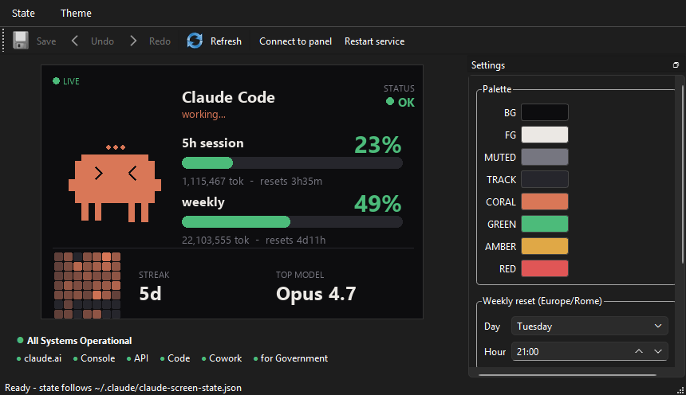
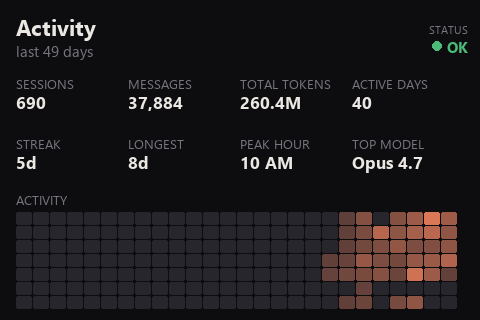
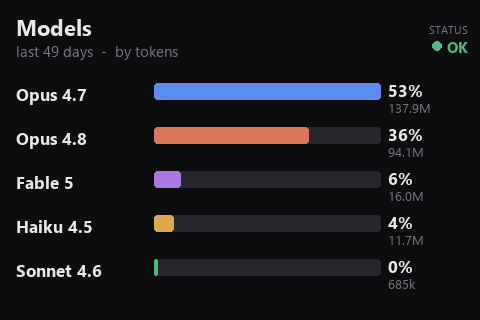

# Claude Code Status Buddy

A tiny desktop companion (and physical USB-panel widget) that shows your **Claude Code usage at a glance** — the exact same numbers `/usage` reports — with a pixel mascot that reacts to what Claude is doing.



It answers the two questions you keep asking mid-session: *how much of my 5-hour and weekly limits have I burned, and is Claude waiting on me?* The 5h / weekly gauges read straight from Anthropic's usage endpoint, and the buddy flips to a flashing **"NEEDS YOU"** alert the moment Claude asks you a question.

> Originally a fork of [mathoudebine/turing-smart-screen-python](https://github.com/mathoudebine/turing-smart-screen-python) (GPLv3). The upstream USB-panel driver (`library/lcd/`) is reused to push frames to a Turing 3.5" screen; everything else here is purpose-built for Claude Code.

---

## What it shows

- **5h session & weekly gauges** — exact utilization percentages and reset countdowns, pulled from `https://api.anthropic.com/api/oauth/usage` (the data behind `/usage`). A small **LIVE / CACHED / EST** dot in the top-left tells you whether the numbers are fresh from the endpoint, the last cached reading, or a local estimate.
- **The buddy** — a clay-colored mascot that is **working**, **idle**, or **attention** (a flashing **"NEEDS YOU"** alert when Claude asks you a question). "Working" is detected from live transcript activity, so it stays accurate even mid-task — no reliance on hooks firing.
- **Idle stat screens** — when Claude is idle, the screen cycles through dashboard-style stats (see below) and snaps back to the gauges the moment work resumes.
- **Confetti** 🎉 when a limit resets.
- **status.claude.com strip** — overall health + per-component dots (claude.ai, Console, API, Code, …), live from the Statuspage API.

## When Claude is idle

The panel cycles through two stat pages every 30 seconds, parsed from your local `~/.claude/projects/**/*.jsonl`:

| Activity | Models |
|:---:|:---:|
|  |  |

**Activity** shows sessions, messages, total tokens, active days, current/longest streak, peak hour, favorite model, and a weekday-aligned activity heatmap. **Models** breaks down token usage per model. The moment Claude starts working again, the screen returns to the live usage gauges.

## Two ways to run it

### 1. Desktop app (`claude_app.py`)
A PySide6 window with a live preview, a **State** override menu, a **Theme** editor (palette, weekly-reset anchor, token-budget calibration, brightness) with Save / Undo / Redo, and the status strip. The toolbar also has:
- **Connect to panel** — drive the physical screen from the app (takes the panel over from the background daemon).
- **Refresh** (F5) — force an immediate live usage fetch.
- **Restart service** — cleanly restart the background daemon (the `ClaudeStatusBuddy` task) so it picks up updates, without wedging the panel.

```bat
start_app.bat            REM or:  pyw -3.13 claude_app.py
```

### 2. Physical Turing USB panel (`claude_screen.py`)
A headless daemon that renders the dashboard and streams it to a Turing 3.5" / TURZX USB screen over serial.

```bat
start_widget.bat         REM start the daemon  (pyw -3.13 claude_screen.py)
stop_widget.bat          REM stop it (reads the PID file)
```

```bat
python claude_screen.py --preview     REM render sample frames to ./preview_*.png (no hardware)
python claude_screen.py --demo        REM cycle idle/working/attention on the panel
```

## Setup

Requires **Python 3.13** (pinned — see [Python 3.13 note](#notes)).

```bat
pip install -r requirements.txt        REM widget core: pyserial, Pillow, numpy
pip install -r requirements-app.txt    REM desktop app extras: PySide6, tzdata
```

### Wire up the state hooks (so the buddy reacts)
`install_hooks.py` merges the lifecycle hooks into `~/.claude/settings.json`:

```bat
python install_hooks.py --script "%CD%\set_state.py"
python install_hooks.py --remove        REM to undo
```

| Hook event | State | When |
|---|---|---|
| `UserPromptSubmit` | working | you send a prompt |
| `PreToolUse` (matcher `AskUserQuestion`) | **attention** | Claude opens a question dialog and waits for you |
| `PostToolUse` | working | a tool finished / your answer was received |
| `Notification` | attention | permission prompts, idle "waiting for you", MCP elicitations |
| `Stop` | idle | the turn ended |

`set_state.py` is the lightweight hook entry point — it just writes `~/.claude/claude-screen-state.json`, which the daemon and the app both read. The `attention` alert **persists until you respond** (it doesn't auto-decay). Claude Code snapshots hooks at startup, so restart your session (or run `/hooks`) after installing.

The hooks mainly drive the **attention** alert; **working / idle** is detected independently from transcript activity, so the buddy stays correct even if the hooks are stale or haven't been reloaded yet.

### Auto-start at login (optional, Windows)
```powershell
powershell -ExecutionPolicy Bypass -File install_autostart.ps1     # registers a "ClaudeStatusBuddy" scheduled task
powershell -ExecutionPolicy Bypass -File uninstall_autostart.ps1
```

## How usage is measured

The gauges use Claude Code's own OAuth token (from `~/.claude/.credentials.json`) to call the usage endpoint, refreshing the token when it expires (and writing the rotated token back, so the CLI stays logged in). This is why the percentages match `/usage` exactly instead of drifting like a token-count estimate would.

Polling is deliberately gentle (every 5 min, with cross-process dedupe via a shared cache and back-off on HTTP 429) since the endpoint rate-limits. Each good reading is cached to disk, so a restart or a brief outage shows the last live value (the **CACHED** dot) rather than dropping to a far-off estimate — and the **Refresh** button forces an immediate fetch when you want the exact number now.

Diagnostic — print the raw endpoint response any time a gauge looks off:
```bat
python tools/check-claude-usage.py
```

## Hardware / configuration

Knobs live at the top of [`claude_screen.py`](claude_screen.py):

| Setting | Default | Notes |
|---|---|---|
| `COM_PORT` | `COM5` | your panel's serial port |
| `REVISION` | `A` | Turing 3.5" / TURZX = rev A; `B` / `C` also supported |
| `WIDTH, HEIGHT` | `480, 320` | dashboard is drawn in landscape, rotated to the panel's native portrait buffer |
| `BRIGHTNESS` | `50` | rev A runs hot — keep ≤ 50% |
| `WEEKLY_TZ_NAME` / `WEEKLY_RESET_*` | `Europe/Rome`, Tue 21:00 | weekly reset anchor (find yours in `/usage`); also editable in the app |

## Notes

- **Python 3.13** is required: the panel driver and PySide6 packages are installed for 3.13 on this machine (3.14 has no wheels yet).
- The desktop app and the daemon share one renderer (`render_frame` / `compute_usage` / `draw_buddy` in `claude_screen.py`), so they always look identical. Only one process should own the COM port at a time — the app kills a running daemon (via its PID file) before connecting.

## Credits & license

This project is a fork of [turing-smart-screen-python](https://github.com/mathoudebine/turing-smart-screen-python) and remains licensed under **GPLv3** (see [LICENSE](LICENSE), [AUTHORS](AUTHORS), [COPYRIGHT](COPYRIGHT)). All Turing / XuanFang / Kipye trademarks belong to their respective owners; this is unofficial, unaffiliated software.
